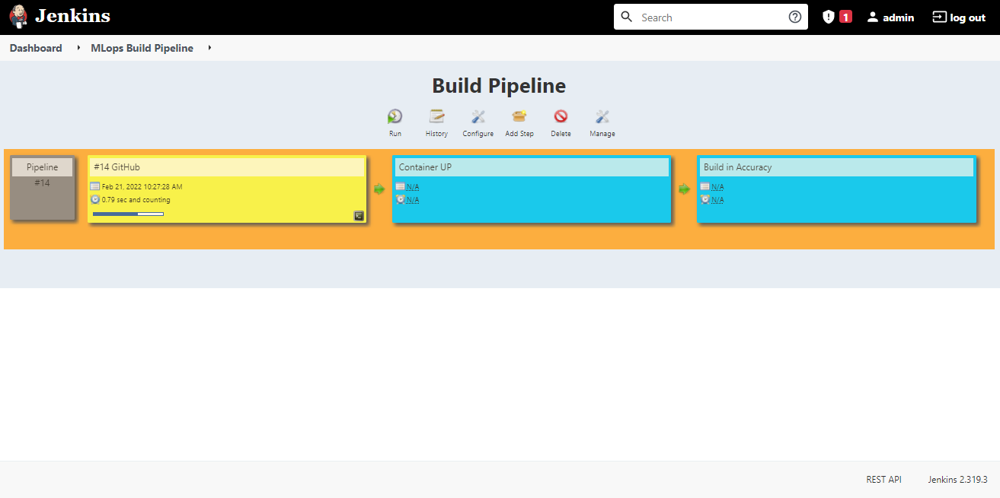

# MLAutomation-devops
Machine Learning and DevOps are combined in this project.

This project involves the combination of Machine Learning with DevOps. In Machine Learning, I used the KNN (K Nearest Neighbor) algorithm to solve a clustering problem, then linked it with DevOps tools to automate the testing process and, if possible, improve accuracy.

When we have a clustering-related problem to address, we employ the KNN machine learning algorithm. As an example, suppose you create groups and then categorise the datapoints within those groups based on some parameters or client needs.
KNN does not train the model in the traditional way, with optimizers, epochs, and so on. It generates a cluster map by grouping datapoints and includes a predicted column with values ranging from 1 to the number of clusters, indicating which group this entry belongs to. If you ask it to make a forecast, it will group the characteristics into clusters to determine which group these values belong to and then make a prediction based on that group.

# In Machine Learning:
When we have a clustering problem to address, we apply the KNN machine learning algorithm. As an example, forming groups and then categorising the datapoints within those categories based on specific parameters or client needs.

KNN does not train the model in the traditional way, with optimizers, running epochs, and so on. It builds a map of clusters by grouping the datapoints and includes a predicted column with values ranging from 1 to the number of clusters, indicating which group this entry belongs to. If you ask it to make a forecast, it will group the characteristics into clusters to check which group these values belong to and then make a prediction based on that group.

KNN employs a feature learning approach, in which it learns the placements of features in clusters such that when new features are presented in the form of a prediction, it can predict which group they should belong to.

# In DevOps

## Jenkins
Jenkins is a self-contained, open source automation server that may be used to automate a variety of operations related to software development, testing, and delivery. Jenkins can be installed via native system packages, Docker, or even run solo on any machine that has the Java Runtime Environment (JRE).

## Git
Git is a free and open source distributed version control system that can handle everything from tiny to very large projects with ease. Git is by far the most popular modern version control system in use today. Git is an example of a distributed version control system (DVCS) because it has a distributed architecture (hence Distributed Version Control System). Rather than having a single repository for the whole version history of the software, as is the case with once-popular version control systems like CVS or Subversion (commonly known as SVN), Git allows each developer's working copy of the code to serve as a repository for all changes.

## Docker
Docker is a programme that uses containers to make it easier to construct, deploy, and operate applications. Containers enable a developer to bundle a programme with all of its components, including libraries and other dependencies, and deliver it as a single package. The developer may feel comfortable that the application will work on any other Linux machine, independent of any specific settings the machine may have that differ from the machine used for authoring and testing the code, owing to the container.

# Project Explanation
The dataset utilised in the Machine Learning portion was based on the age of people and how much they spend on shopping. To divide them into distinct categories, clusters were created. The number of clusters was set to 3 by the developer to ensure that the code was operating and acting as expected, with an accuracy of roughly 80% when predicting against test data.
We created a number of positions to deal with infrastructure in a phased approach.

## Job1 (GitHub)

This job is a lot easier than the previous one. This work necessitates the installation of Jenkins and Git on your machine. In my local Git, I added a 'hook' in the 'post-commit' file that will automatically push any file committed by the developer to its 'GitHub repository.' Then, in the second phase, I had Jenkins configured to use 'Poll SCM,' which continuously checking at my repository for any changes made, and once it found any, it would download them to its Jenkins workspace, which I asked it to copy to a certain directory.

## Job2 ( ContainerUp ) 
This job gets complex compared to the previous one. In this take was to take run the DockerFile containing all the details to launch our own container image containing especially that program which the programmer just sent and `setting up the whole infrastructure just for that single program.` Here first we are `checking` that no image is already running under the same name which might cause a conflict so not only for the image, but also for the container and the volume we first checked if any with same name is present, if yes then remove it and launch a new one. A new completely empty one which is made only to host the files of this new project given by developer. Name of the image is `production:latest` and container is `mlops` and the volume is `mlvol.`

## Job3 ( Build_IncAccuracy )
This is the most critical and final portion of the pipeline. The container that was created in the previous task is switched on, and a'script is injected' into it before it is run. The model's training results are examined. We check to see if the code is working properly; otherwise, it would have 'thrown an error' and failed. The resultant model is then 'checked for accuracy.'
Well yes, the most part is achieved by a script running inside it because I am `not using any docker plugin` in Jenkins but doing it with what we already have and this we have a major problem which is `container is another O.S.` and Jenkins is running in another O.S. so I execute the commands in container the same way we usually do in the O.S. where we have Jenkins installed. It was performed with the `exec command` in docker where we sent multiple commands separated with semi-colon without getting inside it.

### Notification
Finally, there's the Notification system, which incorporates a 'email method.' I have created an email system that delivers emails to developers in three different scenarios. First, before beginning this job, which means we've'successfully created' the environment and are now ready to evaluate the model. Second, in the event of any 'failure,' because this would imply that the evaluation failed, indicating a failure in the execution of new code created as a result of the improvement improvements. The final one states that all jobs have been'successfully adjusted,' that we have now achieved more than '90 percent accuracy,' and that everything is ready in the 'allotted container.'

# DockerFile
Created DockerFile to start our own image with a complete environment tailored to the developer's software. 'CentOS' is the operating system I used for model training; however, you can also use Ubuntu, which has a large Machine Learning community. Then I installed 'python3', the programming language in which the programme is written, as well as the libraries required by any KNN software. Then we created a new directory that will specifically house our developer's code and named it a 'working directory,' which will be the default place when we begin this container.Then I copied all of the scripts and files that the script requested. Finally, run 'python interpreter' to run the code and save the results in a file so we can study them for any areas where the code may be improved. Finally, it gives us a 'bash shell' that we can use to perform any commands inside the operating container.

# Script
This is the most crucial area and file in the entire project. This is the file in charge of examining and assessing the program's output. First, we feed the output from the developer's programme to a variable called 'ch,' and then multiply it to make it comparable with a 90% accuracy rate. Then there's a conditional statement that examines whether or not the accuracy we already have is less than 90%.If the accuracy is less than 90%, we proceed to improve the accuracy by examining if the code contains any functions or libraries that can be used to increase the accuracy; however, because we are only testing for KNN models, these functions are only applicable to KNN models. After that, we check for various numbers of clusters to see what is the most optimum number of clusters we should have to obtain maximum accuracy after finishing the alterations. However, we must first determine whether such a mechanism exists.Then we build the program again and the model recieved at the end is stored in the directory to be used in programs as intended by the developer and we output the final result with `cat` command.
